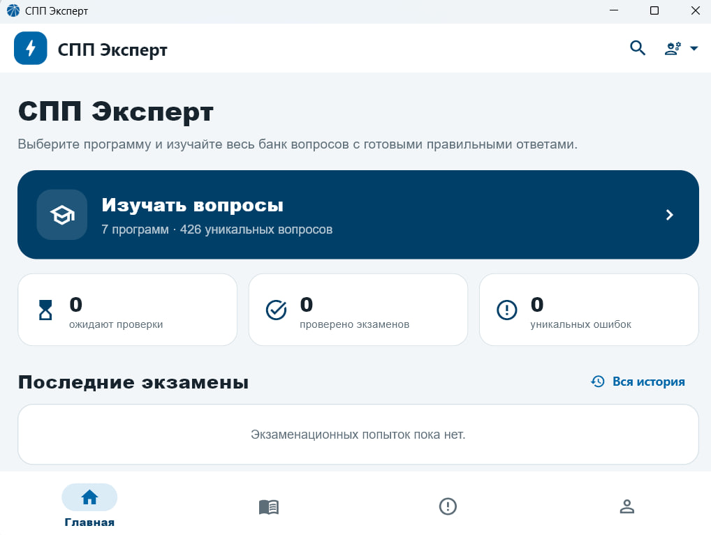
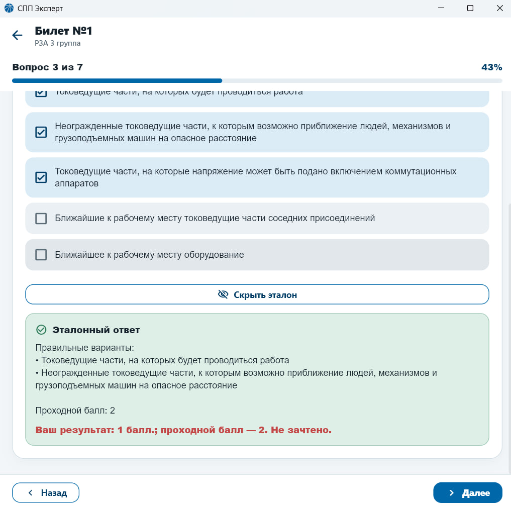
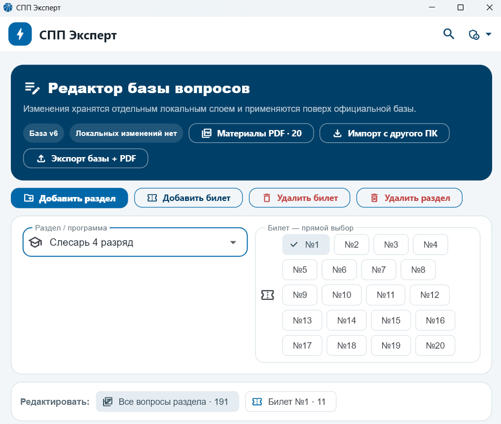
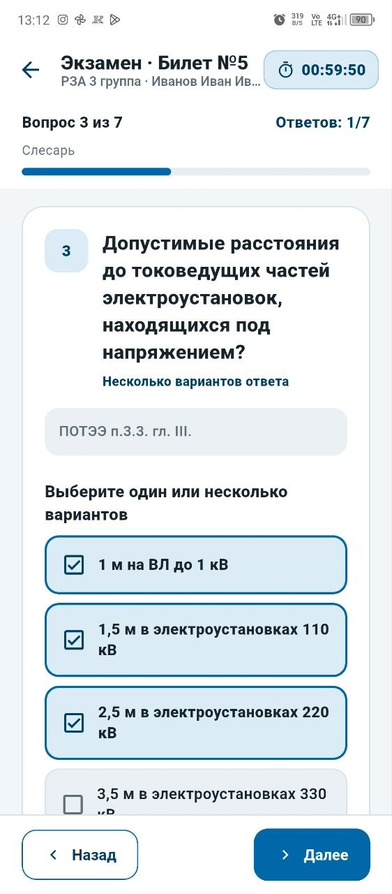

# СПП-Эксперт

### Цифровая платформа для подготовки персонала электроэнергетических предприятий

Подготовка по локальным билетам подразделения, мгновенная проверка ответов, нормативные материалы и административный редактор — в одном приложении.

**[⬇️ Скачать последнюю версию](https://github.com/VARositsky/spp-expert-releases/releases/latest)**

---

## О проекте

**СПП-Эксперт** — система подготовки производственного персонала к проверке знаний и аттестации.

Основное отличие платформы — работа не только с общей нормативной базой, но и с **локальными билетами конкретного подразделения**. Сотрудник может готовиться с компьютера или мобильного устройства, сразу видеть результат ответа и обращаться к связанным нормативным материалам.

Приложение предусматривает инструменты как для сотрудников, так и для администраторов учебного контента.

---

## Интерфейс

### Подготовка сотрудника

  
  

### Администрирование и мобильная версия

  
  

> Скриншоты показывают интерфейс текущей версии приложения. Состав учебной базы может отличаться в зависимости от подразделения и программы подготовки.

---

## Возможности

### Для сотрудника

- подготовка по локальным билетам подразделения;
- режим обучения с мгновенной проверкой ответа;
- пояснения и переход к нормативным материалам;
- тестирование по разделам и программам подготовки;
- поиск по базе вопросов;
- отслеживание прогресса;
- работа с компьютера и мобильного устройства.

### Для администратора

- просмотр и редактирование базы вопросов;
- управление билетами и программами подготовки;
- добавление и актуализация учебного контента;
- работа с нормативными материалами;
- настройка локальной базы под конкретное подразделение.

---

## Скачать

Готовые сборки публикуются только в разделе **Releases**.

### Windows

**Файл:** `SPP-Expert-Windows.zip`

[Скачать последнюю Windows-версию](https://github.com/VARositsky/spp-expert-releases/releases/latest)

1. Скачайте ZIP-архив из последнего релиза.
2. Распакуйте **весь архив** в отдельную папку.
3. Запустите `.exe` файл приложения.
4. Не перемещайте `.exe` отдельно от остальных файлов сборки.

> Для работы Windows-версии рядом с `.exe` должны оставаться необходимые библиотеки и папка `data`.

### Android

**Файл:** `SPP-Expert-Android.apk`

[Скачать последнюю Android-версию](https://github.com/VARositsky/spp-expert-releases/releases/latest)

1. Скачайте APK из последнего релиза.
2. Откройте файл на Android-устройстве.
3. При необходимости разрешите установку приложений из выбранного источника.
4. Завершите установку.

> Android может показать стандартное предупреждение при установке APK не из Google Play.

---

## Поддерживаемые платформы

| Платформа | Статус |
|---|---|
| Windows 10/11 x64 | ✅ Поддерживается |
| Android | ✅ Поддерживается |

---

## Последний релиз

Актуальная версия всегда доступна по постоянной ссылке:

**https://github.com/VARositsky/spp-expert-releases/releases/latest**

История версий и файлы предыдущих сборок находятся в разделе **Releases**.

---

## Статус проекта

СПП-Эксперт находится на стадии **промышленного образца** и развивается как цифровой инструмент подготовки и аттестации персонала электроэнергетических предприятий.

Проект развивается в рамках **«Энергопрорыв 2026»**.

---

## Обратная связь

Если при установке или запуске возникла проблема, создайте обращение через раздел **Issues** этого репозитория и укажите:

- платформу: Windows или Android;
- версию приложения;
- краткое описание проблемы;
- при возможности — скриншот ошибки.

---

## Исходный код

Данный репозиторий предназначен только для публикации официальных сборок СПП-Эксперт.

**Исходный код приложения не распространяется публично.**
